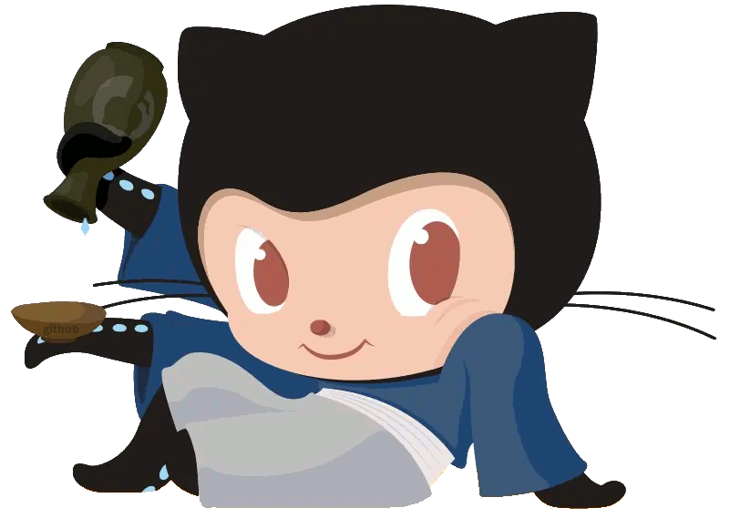

#

 
[**3084793958**](../../../../3084793958)
 

#
# Hey,I am 3084793958.

我是**3084793958**。

Hey,I am **3084793958**.

我来自**中国**。

I come from **China**.

我是**学生**。

I am a **student**.
#
# Accounts
**QQ:ID:**<i>3084793958</i>

**mail:**<i>qq3084793958@outlook.com</i>

[**bilibili:**](https://www.bilibili.com/)**ID**:<i>[1188773803](https://space.bilibili.com/1188773803)</i> **Name:**<i>3084793958</i>
#
# Now
[**Deepin**](https://www.deepin.org/index/zh) <kbd>**20.8**</kbd>

[**Python**](https://www.python.org/) <kbd>**3.7.3**</kbd>

[**Ursina**](https://www.ursinaengine.org/) <kbd>**4.1.1**</kbd>

[**Pyqt5**](https://pypi.org/project/PyQt5/) <kbd>**5.15.2**</kbd>

[**C++**](https://cplusplus.com/) <kbd>**8.3.0**</kbd>

[**Qt Creator**](https://www.qt.io/) <kbd>**4.8.2**</kbd>

[**Qt**](https://www.qt.io/) <kbd>**5.15.6**</kbd>

 

#
# My friends(May be friend)
[**strh520**](../../../../strh520)

 

#
# Pinned

**Be patient,my friends...**
 
**鸽，继续鸽...**

